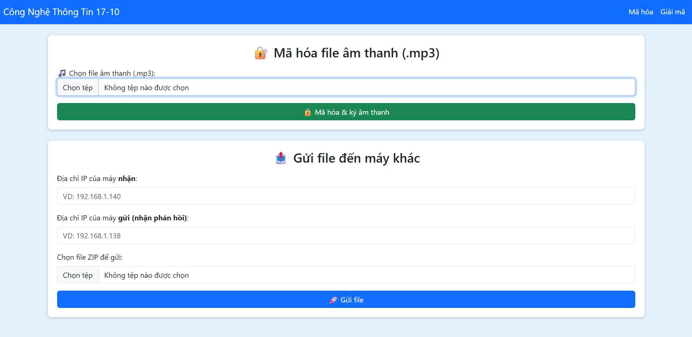
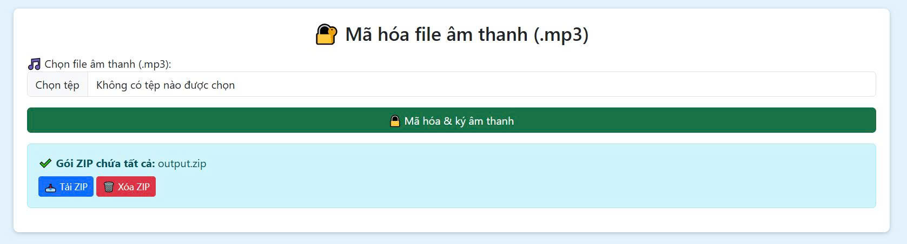
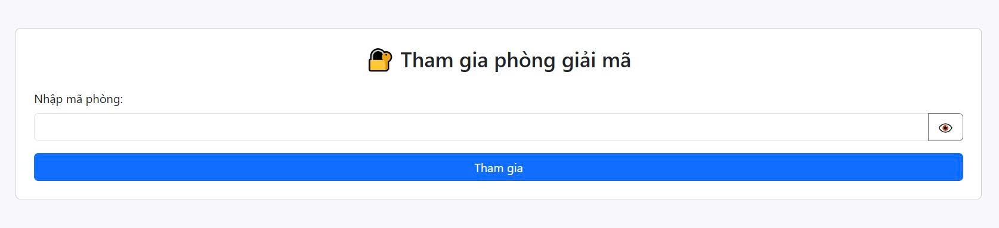
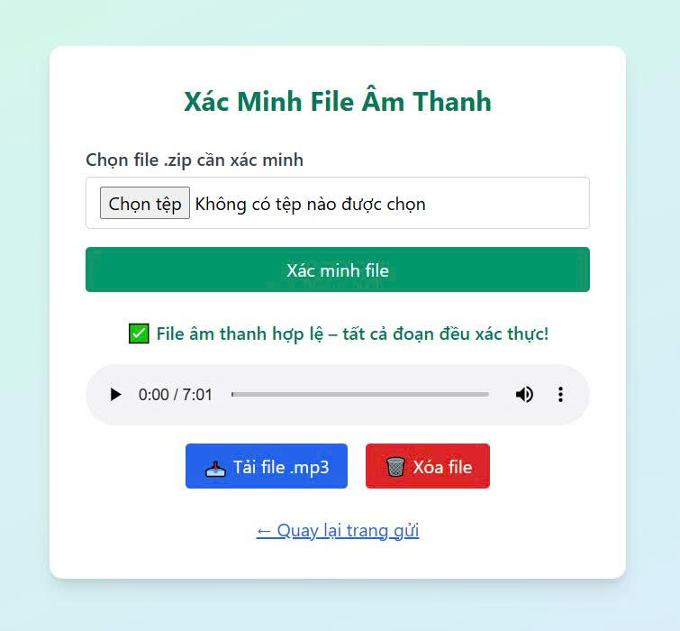
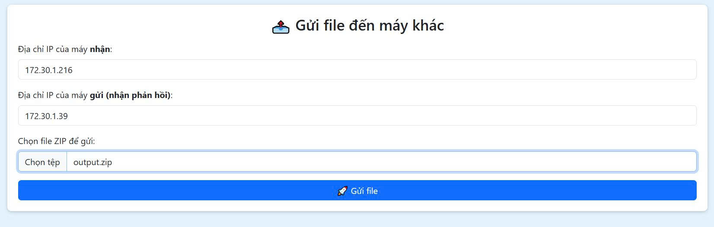
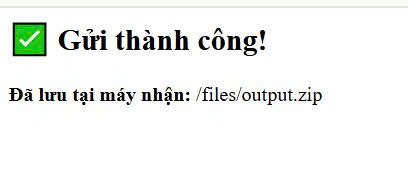
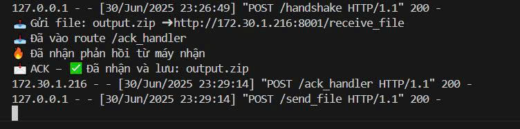
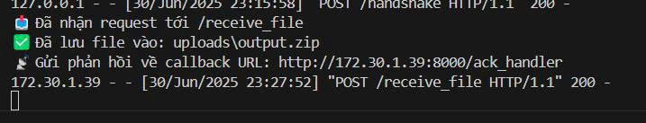

# 🎧 Đề tài 7: Gửi Tập Tin Âm Thanh Chia Thành Nhiều Đoạn

## 📘 Mô tả

Hệ thống gồm **hai ứng dụng Flask**: `app_gui.py` (Người gửi) và `app_nhan.py` (Người nhận), dùng để **gửi một file âm thanh `.mp3` quan trọng qua mạng LAN** bằng cách chia nhỏ thành 3 đoạn, mã hóa, ký số và kiểm tra toàn vẹn.

Mục tiêu:
- Đảm bảo an toàn khi truyền dữ liệu qua mạng không ổn định.
- Ngăn chặn việc chỉnh sửa hoặc giả mạo nội dung tệp.

---

## 🔐 Yêu cầu bảo mật

| Thành phần              | Phương pháp sử dụng                          |
|--------------------------|---------------------------------------------|
| **Mã hóa nội dung**      | Triple DES (DES-EDE3, chế độ CBC)           |
| **Trao khóa bảo mật**    | RSA 2048-bit (OAEP)                         |
| **Ký số & xác thực**     | RSA/SHA-512                                 |
| **Kiểm tra toàn vẹn**    | Hàm băm SHA-512 trên `IV + Ciphertext`      |

---

## 🧩 Luồng xử lý

### Người Gửi (`app_gui.py`)
1. Giao diện web chọn tệp `.mp3`.
2. Chia tệp âm thanh thành 3 phần.
3. Mỗi phần được:
   - Mã hóa bằng Triple DES với `Session Key` sinh ngẫu nhiên.
   - Hash bằng SHA-512.
   - Ký metadata (tên file, timestamp, thời lượng) bằng RSA/SHA-512.
4. Session Key được mã hóa bằng RSA OAEP (public key của người nhận).
5. Gói tin gồm:

```
metadata.txt  
session_key_rsa.bin  
segment_1.bin, iv_1.bin, hash_1.txt, sig_1.sig  
segment_2.bin, iv_2.bin, hash_2.txt, sig_2.sig  
segment_3.bin, iv_3.bin, hash_3.txt, sig_3.sig
```

6. Nén các file trên vào `output.zip` và gửi đến IP máy nhận.

---

### Người Nhận (`app_nhan.py`)
1. Nhận file `.zip` qua route `/receive_file`.
2. Giải mã Session Key bằng private key.
3. Xác minh chữ ký metadata.
4. Kiểm tra `SHA-512(IV + ciphertext)` từng đoạn.
5. Nếu tất cả hợp lệ:
   - Giải mã bằng Triple DES.
   - Ghép thành `output_received.mp3`.
   - Gửi phản hồi `ACK` về cho máy gửi.
6. Nếu sai hash/chữ ký, gửi phản hồi `NACK`.

---

## 🗂️ Cấu trúc thư mục

```
📁 project/
├── keys/
│   ├── private.pem
│   └── public.pem
├── templates/
│   ├── index.html
│   ├── room.html
│   ├── verify.html
├── uploads/
├── app_gui.py
├── app_nhan.py
├── gen_keys.py
└── README.md
```

---

## 🚀 Hướng dẫn chạy thử

### 1. Cài đặt môi trường
```bash
pip install flask pycryptodome mutagen requests
```

### 2. Tạo cặp khóa RSA
```bash
python gen_keys.py
```

### 3. Chạy ứng dụng

#### Máy gửi:
```bash
python app_gui.py
# Chạy tại: http://localhost:8000
```

#### Máy nhận:
```bash
python app_nhan.py
# Chạy tại: http://localhost:8001
```

### 4. Truy cập giao diện
- **Gửi file:** Truy cập http://<IP-máy-gửi>:8000/
- **Xác minh file:** Truy cập http://<IP-máy-nhận>:8001/ (mã phòng: `123456`)

---

## ✅ Kết quả mong đợi

- Nếu tệp hợp lệ: máy nhận giải mã, ghép file và phát lại `output_received.mp3`, đồng thời gửi `"ACK"` phản hồi.
- Nếu lỗi: gửi `"NACK"` với thông báo chi tiết.
<p align="center">
  
</p>
<p align="center">
  
</p>
<p align="center">
  
</p>
<p align="center">
  
</p>
<p align="center">
  
</p>
<p align="center">
  
</p>
<p align="center">
  
</p>
<p align="center">
  
</p>
---

## 📌 Tác giả

> Bài tập lớn học phần *Nhập môn An toàn và Bảo mật thông tin*.  
> Toàn bộ hệ thống được xây dựng bằng Python + Flask + PyCryptodome.
